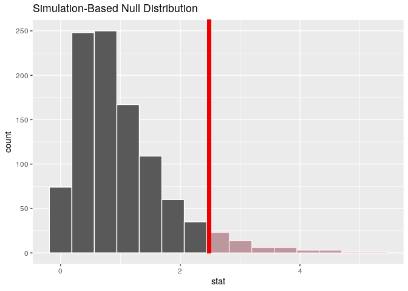

# infer R Package 

-----

<!--figs/infer.svg-->

<!--http://www.r-pkg.org/badges/version/infer-->

<!--figs/master.svg-->

<!--https://img.shields.io/codecov/c/github/tidymodels/infer/master.svg-->

[](https://cran.r-project.org/package=infer)
[](https://travis-ci.org/tidymodels/infer)
[](https://ci.appveyor.com/project/tidymodels/infer)
[](https://codecov.io/github/tidymodels/infer/?branch=master)

The objective of this package is to perform statistical inference using
an expressive statistical grammar that coheres with the `tidyverse`
design framework. The package is centered around 4 main verbs,
supplemented with many utilities to visualize and extract value from
their outputs.

  - `specify()` allows you to specify the variable, or relationship
    between variables, that you’re interested in.
  - `hypothesize()` allows you to declare the null hypothesis.
  - `generate()` allows you to generate data reflecting the null
    hypothesis.
  - `calculate()` allows you to calculate a distribution of statistics
    from the generated data to form the null distribution.

To learn more about the principles underlying the package design, see
`vignette("infer")`.

<!-- -->

### Installation

-----

To install the current stable version of `infer` from CRAN:

``` r
install.packages("infer")
```

To install the developmental version of `infer`, make sure to install
`remotes` first. The `pkgdown` website for this version is at
<https://infer.netlify.com>.

``` r
install.packages("remotes")
remotes::install_github("tidymodels/infer")
```

To install the cutting edge version of `infer` (do so at your own risk),
make sure to install `remotes` first.

``` r
install.packages("remotes")
remotes::install_github("tidymodels/infer", ref = "develop")
```

To see documentation for the developmental version of `infer`, the
developmental `pkgdown` site is available at
<https://infer-dev.netlify.com>.

### Contributing

-----

We welcome others helping us make this package as user-friendly and
efficient as possible. Please review our
[contributing](https://github.com/tidymodels/infer/blob/master/CONTRIBUTING.md)
and
[conduct](https://github.com/tidymodels/infer/blob/master/CONDUCT.md)
guidelines. Please see the open
[issues](https://github.com/tidymodels/infer/issues) for more specific
fixes/additions needing attention. By participating in this project you
agree to abide by its terms.

### Examples

-----

These examples are pulled from the “Full infer Pipeline Examples”
vignette, accessible by calling `vignette("observed_stat_examples")`.
They make use of the `gss` dataset supplied by the package, providing a
sample of data from the [General Social Survey](https://gss.norc.org).
The data looks like this:

``` r
# load in the dataset
data(gss)

# take a glimpse at it
str(gss)
```

    ## Classes 'tbl_df', 'tbl' and 'data.frame':    3000 obs. of  11 variables:
    ##  $ year   : num  2008 2006 1985 1987 2006 ...
    ##   ..- attr(*, "label")= chr "gss year for this respondent "
    ##   ..- attr(*, "format.stata")= chr "%8.0g"
    ##  $ age    : num  37 29 58 40 39 37 53 41 55 47 ...
    ##  $ sex    : Factor w/ 2 levels "male","female": 1 2 1 1 2 1 2 1 1 1 ...
    ##  $ college: Factor w/ 2 levels "no degree","degree": 1 1 2 2 1 1 1 1 1 1 ...
    ##  $ partyid: Factor w/ 5 levels "dem","ind","rep",..: 1 1 2 3 1 1 1 3 2 3 ...
    ##  $ hompop : num  4 3 3 5 5 5 4 1 5 4 ...
    ##  $ hours  : num  50 NA 60 84 40 50 NA 60 NA 40 ...
    ##  $ income : Ord.factor w/ 12 levels "lt $1000"<"$1000 to 2999"<..: 12 1 12 12 6 12 11 12 NA 12 ...
    ##  $ class  : Factor w/ 6 levels "lower class",..: 2 3 3 3 NA 2 2 2 3 2 ...
    ##  $ finrela: Factor w/ 6 levels "far below average",..: 2 2 5 1 NA 3 NA 3 3 3 ...
    ##  $ weight : num  0.875 0.43 1.554 1.01 0.859 ...

As an example, we’ll run an analysis of variance on `age` and `partyid`,
testing whether the age of a respondent is independent of their
political party affiliation.

Calculating the observed statistic,

``` r
F_hat <- gss %>% 
  specify(age ~ partyid) %>%
  calculate(stat = "F")
```

Then, generating the null distribution,

``` r
null_distn <- gss %>%
   specify(age ~ partyid) %>%
   hypothesize(null = "independence") %>%
   generate(reps = 1000, type = "permute") %>%
   calculate(stat = "F")
```

Visualizing the observed statistic alongside the null distribution,

``` r
visualize(null_distn) +
  shade_p_value(obs_stat = F_hat, direction = "greater")
```

<!-- -->

Calculating the p-value from the null distribution and observed
statistic,

``` r
null_distn %>%
  get_p_value(obs_stat = F_hat, direction = "greater")
```

    ## # A tibble: 1 x 1
    ##   p_value
    ##     <dbl>
    ## 1       0

Note that the formula and non-formula interfaces (i.e. `age ~ partyid`
vs. `response = age, explanatory = partyid`) work for all implemented
inference procedures in `infer`. Use whatever is more natural for you.
If you will be doing modeling using functions like `lm()` and `glm()`,
though, we recommend you begin to use the formula `y ~ x` notation as
soon as possible.

Other resources are available in the package vignettes\! See
`vignette("observed_stat_examples")` for more examples like the one
above, and `vignette("infer")` for discussion of the underlying
principles of the package design.
