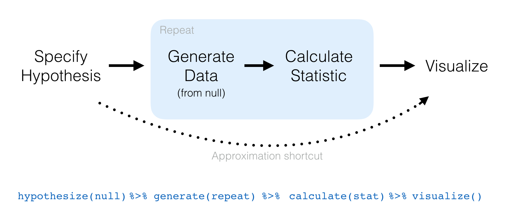

-   [Infer: a grammar for statistical inference](#infer-a-grammar-for-statistical-inference)
    -   [Hypothesis tests](#hypothesis-tests)
    -   [Confidence intervals](#confidence-intervals)

Infer: a grammar for statistical inference
------------------------------------------

The objective of this package is to perform statistical inference using a grammar that illustrates the underlying concepts and a format that coheres with the `tidyverse`.

### Hypothesis tests

### Confidence intervals
