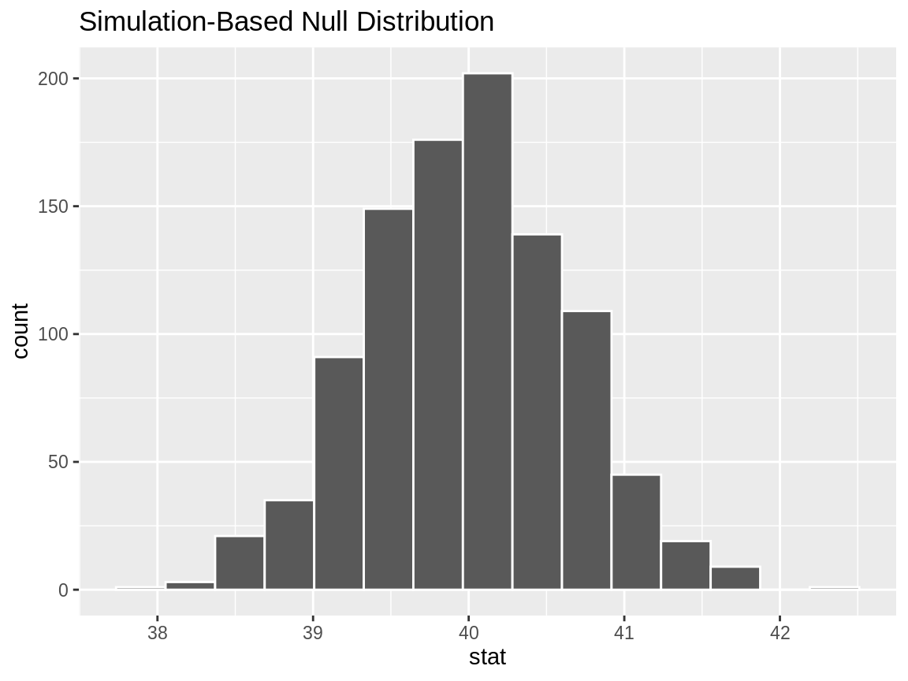
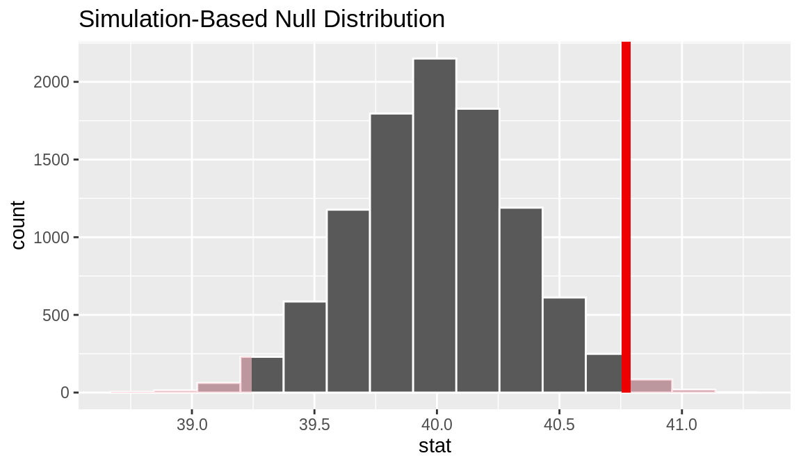
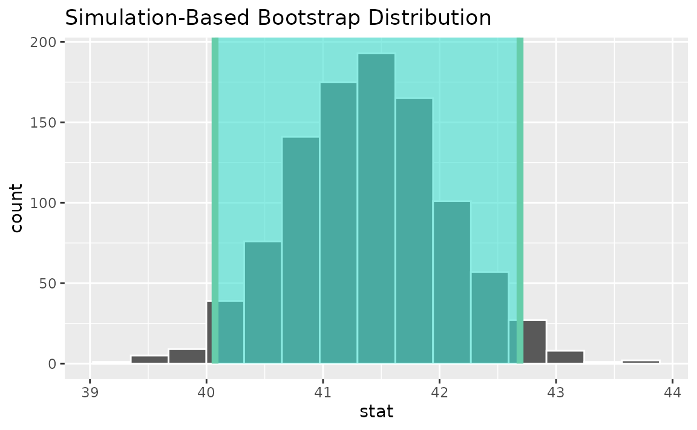
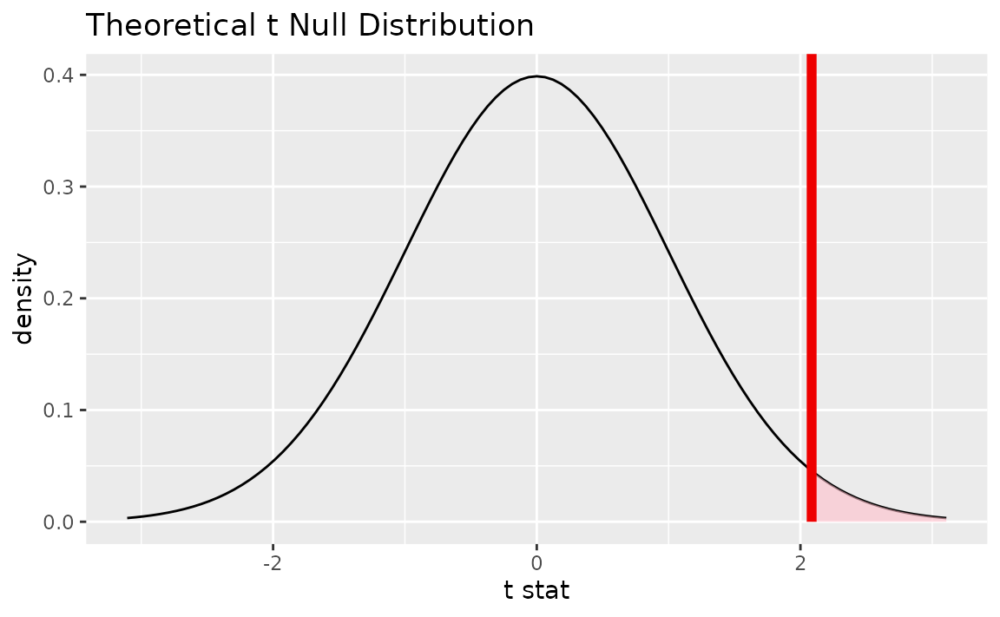
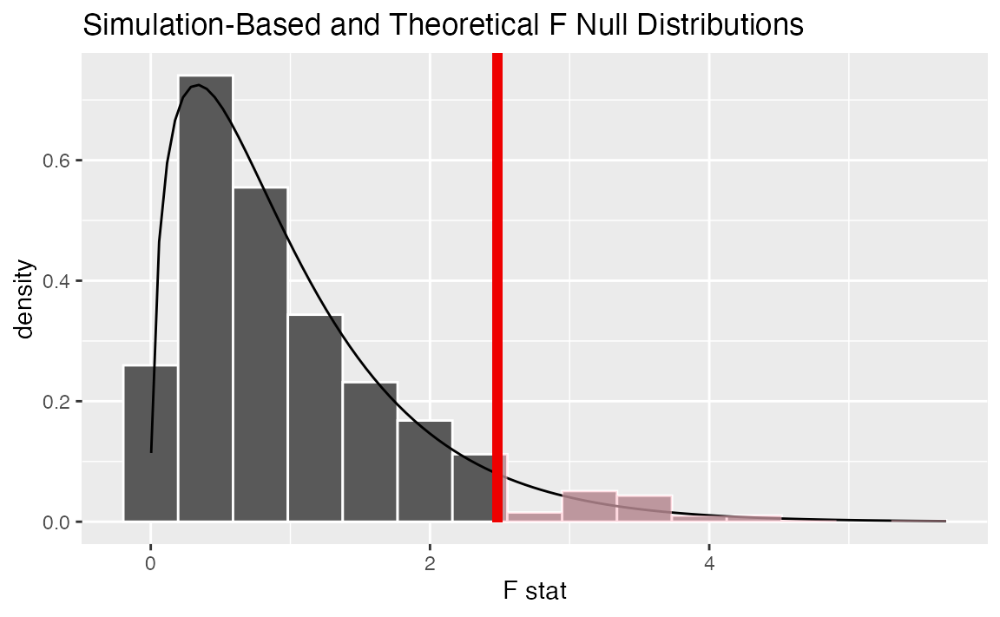
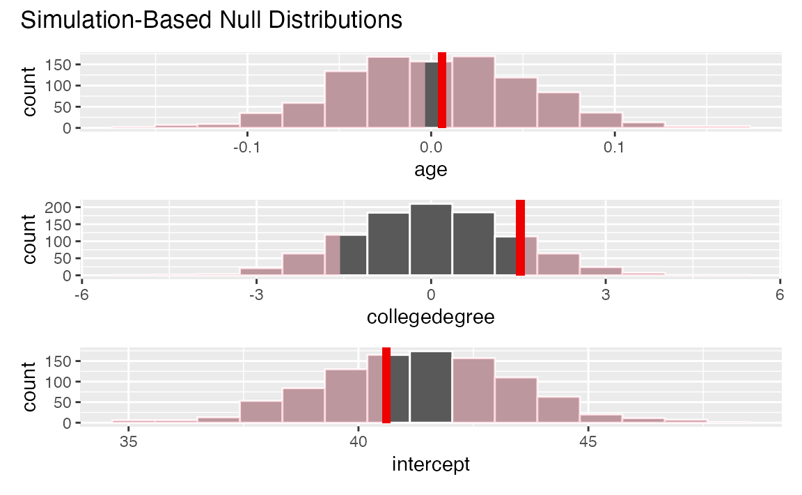

# Getting to Know infer

### Introduction

infer implements an expressive grammar to perform statistical inference
that coheres with the tidyverse design framework. Rather than providing
methods for specific statistical tests, this package consolidates the
principles that are shared among common hypothesis tests into a set of 4
main verbs (functions), supplemented with many utilities to visualize
and extract value from their outputs.

Regardless of which hypothesis test we’re using, we’re still asking the
same kind of question: is the effect/difference in our observed data
real, or due to chance? To answer this question, we start by assuming
that the observed data came from some world where “nothing is going on”
(i.e. the observed effect was simply due to random chance), and call
this assumption our *null hypothesis*. (In reality, we might not believe
in the null hypothesis at all—the null hypothesis is in opposition to
the *alternate hypothesis*, which supposes that the effect present in
the observed data is actually due to the fact that “something is going
on.”) We then calculate a *test statistic* from our data that describes
the observed effect. We can use this test statistic to calculate a
*p-value*, giving the probability that our observed data could come
about if the null hypothesis was true. If this probability is below some
pre-defined *significance level* $\alpha$, then we can reject our null
hypothesis.

The workflow of this package is designed around this idea. Starting out
with some dataset,

- [`specify()`](https://infer.tidymodels.org/reference/specify.md)
  allows you to specify the variable, or relationship between variables,
  that you’re interested in.
- [`hypothesize()`](https://infer.tidymodels.org/reference/hypothesize.md)
  allows you to declare the null hypothesis.
- [`generate()`](https://infer.tidymodels.org/reference/generate.md)
  allows you to generate data reflecting the null hypothesis.
- [`calculate()`](https://infer.tidymodels.org/reference/calculate.md)
  allows you to calculate a distribution of statistics from the
  generated data to form the null distribution.

Throughout this vignette, we make use of `gss`, a dataset supplied by
`infer` containing a sample of 500 observations of 11 variables from the
*General Social Survey*.

``` r
# load in the dataset
data(gss)

# take a look at its structure
dplyr::glimpse(gss)
```

    ## Rows: 500
    ## Columns: 11
    ## $ year    <dbl> 2014, 1994, 1998, 1996, 1994, 1996, 1990, 2016, 2000,…
    ## $ age     <dbl> 36, 34, 24, 42, 31, 32, 48, 36, 30, 33, 21, 30, 38, 4…
    ## $ sex     <fct> male, female, male, male, male, female, female, femal…
    ## $ college <fct> degree, no degree, degree, no degree, degree, no degr…
    ## $ partyid <fct> ind, rep, ind, ind, rep, rep, dem, ind, rep, dem, dem…
    ## $ hompop  <dbl> 3, 4, 1, 4, 2, 4, 2, 1, 5, 2, 4, 3, 4, 4, 2, 2, 3, 2,…
    ## $ hours   <dbl> 50, 31, 40, 40, 40, 53, 32, 20, 40, 40, 23, 52, 38, 7…
    ## $ income  <ord> $25000 or more, $20000 - 24999, $25000 or more, $2500…
    ## $ class   <fct> middle class, working class, working class, working c…
    ## $ finrela <fct> below average, below average, below average, above av…
    ## $ weight  <dbl> 0.8960, 1.0825, 0.5501, 1.0864, 1.0825, 1.0864, 1.062…

Each row is an individual survey response, containing some basic
demographic information on the respondent as well as some additional
variables. See [`?gss`](https://infer.tidymodels.org/reference/gss.md)
for more information on the variables included and their source. Note
that this data (and our examples on it) are for demonstration purposes
only, and will not necessarily provide accurate estimates unless
weighted properly. For these examples, let’s suppose that this dataset
is a representative sample of a population we want to learn about:
American adults.

### specify(): Specifying Response (and Explanatory) Variables

The [`specify()`](https://infer.tidymodels.org/reference/specify.md)
function can be used to specify which of the variables in the dataset
you’re interested in. If you’re only interested in, say, the `age` of
the respondents, you might write:

``` r
gss |>
  specify(response = age)
```

    ## Response: age (numeric)
    ## # A tibble: 500 × 1
    ##      age
    ##    <dbl>
    ##  1    36
    ##  2    34
    ##  3    24
    ##  4    42
    ##  5    31
    ##  6    32
    ##  7    48
    ##  8    36
    ##  9    30
    ## 10    33
    ## # ℹ 490 more rows

On the front-end, the output of
[`specify()`](https://infer.tidymodels.org/reference/specify.md) just
looks like it selects off the columns in the dataframe that you’ve
specified. Checking the class of this object, though:

``` r
gss |>
  specify(response = age) |>
  class()
```

    ## [1] "infer"      "tbl_df"     "tbl"        "data.frame"

We can see that the `infer` class has been appended on top of the
dataframe classes–this new class stores some extra metadata.

If you’re interested in two variables–`age` and `partyid`, for
example–you can
[`specify()`](https://infer.tidymodels.org/reference/specify.md) their
relationship in one of two (equivalent) ways:

``` r
# as a formula
gss |>
  specify(age ~ partyid)
```

    ## Response: age (numeric)
    ## Explanatory: partyid (factor)
    ## # A tibble: 500 × 2
    ##      age partyid
    ##    <dbl> <fct>  
    ##  1    36 ind    
    ##  2    34 rep    
    ##  3    24 ind    
    ##  4    42 ind    
    ##  5    31 rep    
    ##  6    32 rep    
    ##  7    48 dem    
    ##  8    36 ind    
    ##  9    30 rep    
    ## 10    33 dem    
    ## # ℹ 490 more rows

``` r
# with the named arguments
gss |>
  specify(response = age, explanatory = partyid)
```

    ## Response: age (numeric)
    ## Explanatory: partyid (factor)
    ## # A tibble: 500 × 2
    ##      age partyid
    ##    <dbl> <fct>  
    ##  1    36 ind    
    ##  2    34 rep    
    ##  3    24 ind    
    ##  4    42 ind    
    ##  5    31 rep    
    ##  6    32 rep    
    ##  7    48 dem    
    ##  8    36 ind    
    ##  9    30 rep    
    ## 10    33 dem    
    ## # ℹ 490 more rows

If you’re doing inference on one proportion or a difference in
proportions, you will need to use the `success` argument to specify
which level of your `response` variable is a success. For instance, if
you’re interested in the proportion of the population with a college
degree, you might use the following code:

``` r
# specifying for inference on proportions
gss |>
  specify(response = college, success = "degree")
```

    ## Response: college (factor)
    ## # A tibble: 500 × 1
    ##    college  
    ##    <fct>    
    ##  1 degree   
    ##  2 no degree
    ##  3 degree   
    ##  4 no degree
    ##  5 degree   
    ##  6 no degree
    ##  7 no degree
    ##  8 degree   
    ##  9 degree   
    ## 10 no degree
    ## # ℹ 490 more rows

### hypothesize(): Declaring the Null Hypothesis

The next step in the infer pipeline is often to declare a null
hypothesis using
[`hypothesize()`](https://infer.tidymodels.org/reference/hypothesize.md).
The first step is to supply one of “independence” or “point” to the
`null` argument. If your null hypothesis assumes independence between
two variables, then this is all you need to supply to
[`hypothesize()`](https://infer.tidymodels.org/reference/hypothesize.md):

``` r
gss |>
  specify(college ~ partyid, success = "degree") |>
  hypothesize(null = "independence")
```

    ## Response: college (factor)
    ## Explanatory: partyid (factor)
    ## Null Hypoth...
    ## # A tibble: 500 × 2
    ##    college   partyid
    ##    <fct>     <fct>  
    ##  1 degree    ind    
    ##  2 no degree rep    
    ##  3 degree    ind    
    ##  4 no degree ind    
    ##  5 degree    rep    
    ##  6 no degree rep    
    ##  7 no degree dem    
    ##  8 degree    ind    
    ##  9 degree    rep    
    ## 10 no degree dem    
    ## # ℹ 490 more rows

If you’re doing inference on a point estimate, you will also need to
provide one of `p` (the true proportion of successes, between 0 and 1),
`mu` (the true mean), `med` (the true median), or `sigma` (the true
standard deviation). For instance, if the null hypothesis is that the
mean number of hours worked per week in our population is 40, we would
write:

``` r
gss |>
  specify(response = hours) |>
  hypothesize(null = "point", mu = 40)
```

    ## Response: hours (numeric)
    ## Null Hypothesis: point
    ## # A tibble: 500 × 1
    ##    hours
    ##    <dbl>
    ##  1    50
    ##  2    31
    ##  3    40
    ##  4    40
    ##  5    40
    ##  6    53
    ##  7    32
    ##  8    20
    ##  9    40
    ## 10    40
    ## # ℹ 490 more rows

Again, from the front-end, the dataframe outputted from
[`hypothesize()`](https://infer.tidymodels.org/reference/hypothesize.md)
looks almost exactly the same as it did when it came out of
[`specify()`](https://infer.tidymodels.org/reference/specify.md), but
infer now “knows” your null hypothesis.

### generate(): Generating the Null Distribution

Once we’ve asserted our null hypothesis using
[`hypothesize()`](https://infer.tidymodels.org/reference/hypothesize.md),
we can construct a null distribution based on this hypothesis. We can do
this using one of several methods, supplied in the `type` argument:

- `bootstrap`: A bootstrap sample will be drawn for each replicate,
  where a sample of size equal to the input sample size is drawn (with
  replacement) from the input sample data.  
- `permute`: For each replicate, each input value will be randomly
  reassigned (without replacement) to a new output value in the
  sample.  
- `draw`: A value will be sampled from a theoretical distribution with
  parameters specified in
  [`hypothesize()`](https://infer.tidymodels.org/reference/hypothesize.md)
  for each replicate. This option is currently only applicable for
  testing point estimates. This generation type was previously called
  `"simulate"`, which has been superseded.

Continuing on with our example above, about the average number of hours
worked a week, we might write:

``` r
set.seed(1)

gss |>
  specify(response = hours) |>
  hypothesize(null = "point", mu = 40) |>
  generate(reps = 1000, type = "bootstrap")
```

    ## Response: hours (numeric)
    ## Null Hypothesis: point
    ## # A tibble: 500,000 × 2
    ## # Groups:   replicate [1,000]
    ##    replicate hours
    ##        <int> <dbl>
    ##  1         1 46.6 
    ##  2         1 43.6 
    ##  3         1 38.6 
    ##  4         1 28.6 
    ##  5         1 38.6 
    ##  6         1 38.6 
    ##  7         1  6.62
    ##  8         1 78.6 
    ##  9         1 38.6 
    ## 10         1 38.6 
    ## # ℹ 499,990 more rows

In the above example, we take 1000 bootstrap samples to form our null
distribution.

Note that, before
[`generate()`](https://infer.tidymodels.org/reference/generate.md)ing,
we’ve set the seed for random number generation with the
[`set.seed()`](https://rdrr.io/r/base/Random.html) function. When using
the infer package for research, or in other cases when exact
reproducibility is a priority, this is good practice. infer will respect
the random seed specified in the
[`set.seed()`](https://rdrr.io/r/base/Random.html) function, returning
the same result when
[`generate()`](https://infer.tidymodels.org/reference/generate.md)ing
data given an identical seed.

To generate a null distribution for the independence of two variables,
we could also randomly reshuffle the pairings of explanatory and
response variables to break any existing association. For instance, to
generate 1000 replicates that can be used to create a null distribution
under the assumption that political party affiliation is not affected by
age:

``` r
gss |>
  specify(partyid ~ age) |>
  hypothesize(null = "independence") |>
  generate(reps = 1000, type = "permute")
```

    ## Response: partyid (factor)
    ## Explanatory: age (numeric)
    ## Null Hypothesi...
    ## # A tibble: 500,000 × 3
    ## # Groups:   replicate [1,000]
    ##    partyid   age replicate
    ##    <fct>   <dbl>     <int>
    ##  1 rep        36         1
    ##  2 rep        34         1
    ##  3 dem        24         1
    ##  4 dem        42         1
    ##  5 dem        31         1
    ##  6 ind        32         1
    ##  7 ind        48         1
    ##  8 rep        36         1
    ##  9 dem        30         1
    ## 10 rep        33         1
    ## # ℹ 499,990 more rows

### calculate(): Calculating Summary Statistics

[`calculate()`](https://infer.tidymodels.org/reference/calculate.md)
calculates summary statistics from the output of infer core functions.
The function takes in a `stat` argument, which is currently one of
“mean”, “median”, “sum”, “sd”, “prop”, “count”, “diff in means”, “diff
in medians”, “diff in props”, “Chisq”, “F”, “t”, “z”, “slope”, or
“correlation”. For example, continuing our example above to calculate
the null distribution of mean hours worked per week:

``` r
gss |>
  specify(response = hours) |>
  hypothesize(null = "point", mu = 40) |>
  generate(reps = 1000, type = "bootstrap") |>
  calculate(stat = "mean")
```

    ## Response: hours (numeric)
    ## Null Hypothesis: point
    ## # A tibble: 1,000 × 2
    ##    replicate  stat
    ##        <int> <dbl>
    ##  1         1  39.2
    ##  2         2  39.1
    ##  3         3  39.0
    ##  4         4  39.8
    ##  5         5  41.4
    ##  6         6  39.4
    ##  7         7  39.8
    ##  8         8  40.4
    ##  9         9  41.5
    ## 10        10  40.9
    ## # ℹ 990 more rows

The output of
[`calculate()`](https://infer.tidymodels.org/reference/calculate.md)
here shows us the sample statistic (in this case, the mean) for each of
our 1000 replicates. If you’re carrying out inference on differences in
means, medians, or proportions, or t and z statistics, you will need to
supply an `order` argument, giving the order in which the explanatory
variables should be subtracted. For instance, to find the difference in
mean age of those that have a college degree and those that don’t, we
might write:

``` r
gss |>
  specify(age ~ college) |>
  hypothesize(null = "independence") |>
  generate(reps = 1000, type = "permute") |>
  calculate("diff in means", order = c("degree", "no degree"))
```

    ## Response: age (numeric)
    ## Explanatory: college (factor)
    ## Null Hypothesi...
    ## # A tibble: 1,000 × 2
    ##    replicate   stat
    ##        <int>  <dbl>
    ##  1         1 -2.35 
    ##  2         2 -0.902
    ##  3         3  0.403
    ##  4         4 -0.426
    ##  5         5  0.482
    ##  6         6 -0.196
    ##  7         7  1.33 
    ##  8         8 -1.07 
    ##  9         9  1.68 
    ## 10        10  0.888
    ## # ℹ 990 more rows

### Other Utilities

infer also offers several utilities to extract the meaning out of
summary statistics and distributions—the package provides functions to
visualize where a statistic is relative to a distribution (with
[`visualize()`](https://infer.tidymodels.org/reference/visualize.md)),
calculate p-values (with
[`get_p_value()`](https://infer.tidymodels.org/reference/get_p_value.md)),
and calculate confidence intervals (with
[`get_confidence_interval()`](https://infer.tidymodels.org/reference/get_confidence_interval.md)).

To illustrate, we’ll go back to the example of determining whether the
mean number of hours worked per week is 40 hours.

``` r
# find the point estimate
obs_mean <- gss |>
  specify(response = hours) |>
  calculate(stat = "mean")

# generate a null distribution
null_dist <- gss |>
  specify(response = hours) |>
  hypothesize(null = "point", mu = 40) |>
  generate(reps = 1000, type = "bootstrap") |>
  calculate(stat = "mean")
```

Our point estimate 41.382 seems *pretty* close to 40, but a little bit
different. We might wonder if this difference is just due to random
chance, or if the mean number of hours worked per week in the population
really isn’t 40.

We could initially just visualize the null distribution.

``` r
null_dist |>
  visualize()
```



Where does our sample’s observed statistic lie on this distribution? We
can use the `obs_stat` argument to specify this.

``` r
null_dist |>
  visualize() +
  shade_p_value(obs_stat = obs_mean, direction = "two-sided")
```



Notice that infer has also shaded the regions of the null distribution
that are as (or more) extreme than our observed statistic. (Also, note
that we now use the `+` operator to apply the
[`shade_p_value()`](https://infer.tidymodels.org/reference/shade_p_value.md)
function. This is because `visualize` outputs a plot object from
`ggplot2` instead of a data frame, and the `+` operator is needed to add
the p-value layer to the plot object.) The red bar looks like it’s
slightly far out on the right tail of the null distribution, so
observing a sample mean of 41.382 hours would be somewhat unlikely if
the mean was actually 40 hours. How unlikely, though?

``` r
# get a two-tailed p-value
p_value <- null_dist |>
  get_p_value(obs_stat = obs_mean, direction = "two-sided")

p_value
```

    ## # A tibble: 1 × 1
    ##   p_value
    ##     <dbl>
    ## 1   0.032

It looks like the p-value is 0.032, which is pretty small—if the true
mean number of hours worked per week was actually 40, the probability of
our sample mean being this far (1.382 hours) from 40 would be 0.032.
This may or may not be statistically significantly different, depending
on the significance level $\alpha$ you decided on *before* you ran this
analysis. If you had set $\alpha = .05$, then this difference would be
statistically significant, but if you had set $\alpha = .01$, then it
would not be.

To get a confidence interval around our estimate, we can write:

``` r
# generate a distribution like the null distribution, 
# though exclude the null hypothesis from the pipeline
boot_dist <- gss |>
  specify(response = hours) |>
  generate(reps = 1000, type = "bootstrap") |>
  calculate(stat = "mean")

# start with the bootstrap distribution
ci <- boot_dist |>
  # calculate the confidence interval around the point estimate
  get_confidence_interval(
    point_estimate = obs_mean,
    # at the 95% confidence level
    level = .95,
    # using the standard error
    type = "se"
  )

ci
```

    ## # A tibble: 1 × 2
    ##   lower_ci upper_ci
    ##      <dbl>    <dbl>
    ## 1     40.1     42.7

As you can see, 40 hours per week is not contained in this interval,
which aligns with our previous conclusion that this finding is
significant at the confidence level $\alpha = .05$. To see this interval
represented visually, we can use the
[`shade_confidence_interval()`](https://infer.tidymodels.org/reference/shade_confidence_interval.md)
utility:

``` r
boot_dist |>
  visualize() +
  shade_confidence_interval(endpoints = ci)
```



### Theoretical Methods

infer also provides functionality to use theoretical methods for
`"Chisq"`, `"F"`, `"t"` and `"z"` distributions.

Generally, to find a null distribution using theory-based methods, use
the same code that you would use to find the observed statistic
elsewhere, replacing calls to
[`calculate()`](https://infer.tidymodels.org/reference/calculate.md)
with [`assume()`](https://infer.tidymodels.org/reference/assume.md). For
example, to calculate the observed $t$ statistic (a standardized mean):

``` r
# calculate an observed t statistic
obs_t <- gss |>
  specify(response = hours) |>
  hypothesize(null = "point", mu = 40) |>
  calculate(stat = "t")
```

Then, to define a theoretical $t$ distribution, we could write:

``` r
# switch out calculate with assume to define a distribution
t_dist <- gss |>
  specify(response = hours) |>
  assume(distribution = "t")
```

From here, the theoretical distribution interfaces in the same way that
simulation-based null distributions do. For example, to interface with
p-values:

``` r
# visualize the theoretical null distribution
visualize(t_dist) +
  shade_p_value(obs_stat = obs_t, direction = "greater")
```



``` r
# more exactly, calculate the p-value
get_p_value(t_dist, obs_t, "greater")
```

    ## # A tibble: 1 × 1
    ##   p_value
    ##     <dbl>
    ## 1  0.0188

Confidence intervals lie on the scale of the data rather than on the
standardized scale of the theoretical distribution, so be sure to use
the unstandardized observed statistic when working with confidence
intervals.

``` r
# find the theory-based confidence interval
theor_ci <- 
  get_confidence_interval(
    x = t_dist,
    level = .95,
    point_estimate = obs_mean
  )

theor_ci
```

    ## # A tibble: 1 × 2
    ##   lower_ci upper_ci
    ##      <dbl>    <dbl>
    ## 1     40.1     42.7

When visualized, the $t$ distribution will be recentered and rescaled to
align with the scale of the observed data.

``` r
# visualize the theoretical sampling distribution
visualize(t_dist) +
  shade_confidence_interval(theor_ci)
```



### Multiple regression

To accommodate randomization-based inference with multiple explanatory
variables, the package implements an alternative workflow based on model
fitting. Rather than
[`calculate()`](https://infer.tidymodels.org/reference/calculate.md)ing
statistics from resampled data, this side of the package allows you to
[`fit()`](https://generics.r-lib.org/reference/fit.html) linear models
on data resampled according to the null hypothesis, supplying model
coefficients for each explanatory variable. For the most part, you can
just switch out
[`calculate()`](https://infer.tidymodels.org/reference/calculate.md) for
[`fit()`](https://generics.r-lib.org/reference/fit.html) in your
[`calculate()`](https://infer.tidymodels.org/reference/calculate.md)-based
workflows.

As an example, suppose that we want to fit `hours` worked per week using
the respondent `age` and `college` completion status. We could first
begin by fitting a linear model to the observed data.

``` r
observed_fit <- gss |>
  specify(hours ~ age + college) |>
  fit()
```

Now, to generate null distributions for each of these terms, we can fit
1000 models to resamples of the `gss` dataset, where the response
`hours` is permuted in each. Note that this code is the same as the
above except for the addition of the
[`hypothesize()`](https://infer.tidymodels.org/reference/hypothesize.md)
and [`generate()`](https://infer.tidymodels.org/reference/generate.md)
step.

``` r
null_fits <- gss |>
  specify(hours ~ age + college) |>
  hypothesize(null = "independence") |>
  generate(reps = 1000, type = "permute") |>
  fit()

null_fits
```

    ## # A tibble: 3,000 × 3
    ## # Groups:   replicate [1,000]
    ##    replicate term          estimate
    ##        <int> <chr>            <dbl>
    ##  1         1 intercept     40.3    
    ##  2         1 age            0.0166 
    ##  3         1 collegedegree  1.20   
    ##  4         2 intercept     41.3    
    ##  5         2 age            0.00664
    ##  6         2 collegedegree -0.407  
    ##  7         3 intercept     42.9    
    ##  8         3 age           -0.0371 
    ##  9         3 collegedegree  0.00431
    ## 10         4 intercept     42.7    
    ## # ℹ 2,990 more rows

To permute variables other than the response variable, the `variables`
argument to
[`generate()`](https://infer.tidymodels.org/reference/generate.md)
allows you to choose columns from the data to permute. Note that any
derived effects that depend on these columns (e.g., interaction effects)
will also be affected.

Beyond this point, observed fits and distributions from null fits
interface exactly like analogous outputs from
[`calculate()`](https://infer.tidymodels.org/reference/calculate.md).
For instance, we can use the following code to calculate a 95%
confidence interval from these objects.

``` r
get_confidence_interval(
  null_fits, 
  point_estimate = observed_fit, 
  level = .95
)
```

    ## # A tibble: 3 × 3
    ##   term          lower_ci upper_ci
    ##   <chr>            <dbl>    <dbl>
    ## 1 age            -0.0948   0.0987
    ## 2 collegedegree  -2.57     2.72  
    ## 3 intercept      37.4     45.5

Or, we can shade p-values for each of these observed regression
coefficients from the observed data.

``` r
visualize(null_fits) + 
  shade_p_value(observed_fit, direction = "both")
```



### Conclusion

That’s it! This vignette covers most all of the key functionality of
infer. See
[`help(package = "infer")`](https://infer.tidymodels.org/reference) for
a full list of functions and vignettes.
