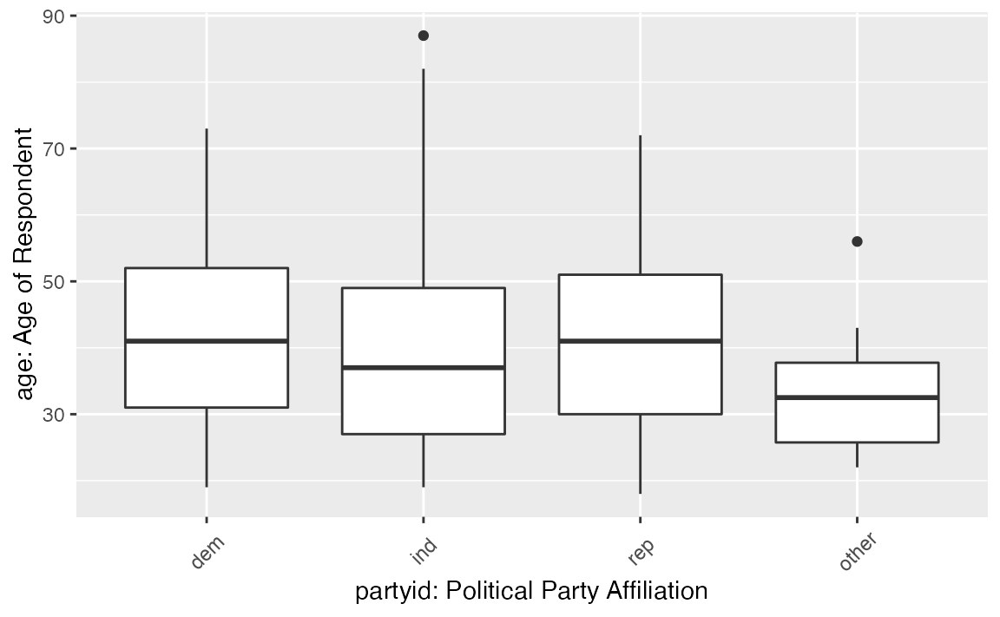
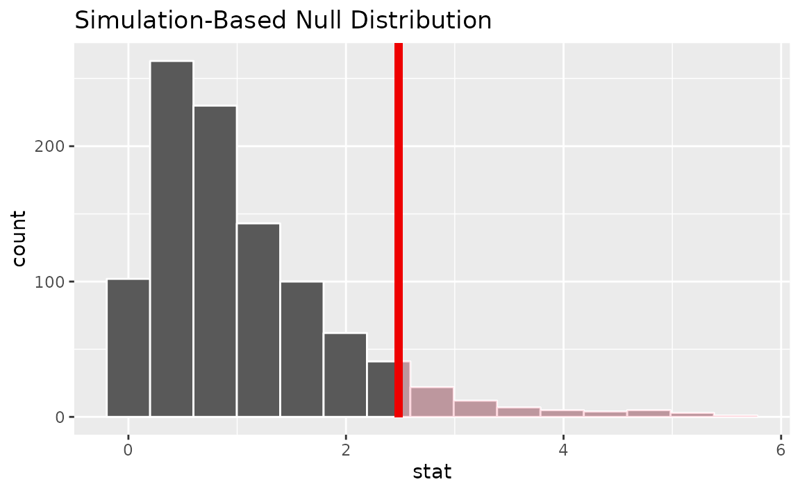
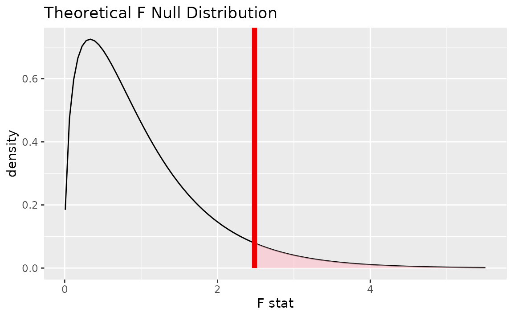
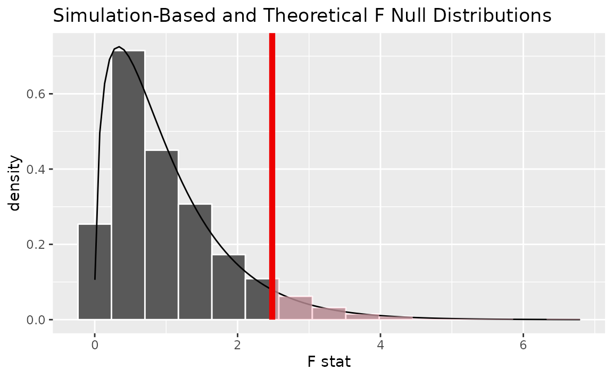

# Tidy ANOVA (Analysis of Variance) with infer

In this vignette, we’ll walk through conducting an analysis of variance
(ANOVA) test using infer. ANOVAs are used to analyze differences in
group means.

Throughout this vignette, we’ll make use of the `gss` dataset supplied
by infer, which contains a sample of data from the General Social
Survey. See [`?gss`](https://infer.tidymodels.org/dev/reference/gss.md)
for more information on the variables included and their source. Note
that this data (and our examples on it) are for demonstration purposes
only, and will not necessarily provide accurate estimates unless
weighted properly. For these examples, let’s suppose that this dataset
is a representative sample of a population we want to learn about:
American adults. The data looks like this:

``` r
dplyr::glimpse(gss)
```

    ## Rows: 500
    ## Columns: 11
    ## $ year    <dbl> 2014, 1994, 1998, 1996, 1994, 1996, 1990, 2016, 2000,…
    ## $ age     <dbl> 36, 34, 24, 42, 31, 32, 48, 36, 30, 33, 21, 30, 38, 4…
    ## $ sex     <fct> male, female, male, male, male, female, female, femal…
    ## $ college <fct> degree, no degree, degree, no degree, degree, no degr…
    ## $ partyid <fct> ind, rep, ind, ind, rep, rep, dem, ind, rep, dem, dem…
    ## $ hompop  <dbl> 3, 4, 1, 4, 2, 4, 2, 1, 5, 2, 4, 3, 4, 4, 2, 2, 3, 2,…
    ## $ hours   <dbl> 50, 31, 40, 40, 40, 53, 32, 20, 40, 40, 23, 52, 38, 7…
    ## $ income  <ord> $25000 or more, $20000 - 24999, $25000 or more, $2500…
    ## $ class   <fct> middle class, working class, working class, working c…
    ## $ finrela <fct> below average, below average, below average, above av…
    ## $ weight  <dbl> 0.8960, 1.0825, 0.5501, 1.0864, 1.0825, 1.0864, 1.062…

To carry out an ANOVA, we’ll examine the association between age and
political party affiliation in the United States. The `age` variable is
a numerical variable measuring the respondents’ age at the time that the
survey was taken, and `partyid` is a factor variable with unique values
ind, rep, dem, other.

This is what the relationship looks like in the observed data:



If there were no relationship, we would expect to see the each of these
boxplots lining up along the y-axis. It looks like the average age of
democrats and republicans seems to be a bit larger than independent and
other American voters. Is this difference just random noise, though?

First, to calculate the observed statistic, we can use
[`specify()`](https://infer.tidymodels.org/dev/reference/specify.md) and
[`calculate()`](https://infer.tidymodels.org/dev/reference/calculate.md).

``` r
# calculate the observed statistic
observed_f_statistic <- gss |>
  specify(age ~ partyid) |>
  hypothesize(null = "independence") |>
  calculate(stat = "F")
```

The observed $F$ statistic is 2.4842. Now, we want to compare this
statistic to a null distribution, generated under the assumption that
age and political party affiliation are not actually related, to get a
sense of how likely it would be for us to see this observed statistic if
there were actually no association between the two variables.

We can
[`generate()`](https://infer.tidymodels.org/dev/reference/generate.md)
an approximation of the null distribution using randomization. The
randomization approach permutes the response and explanatory variables,
so that each person’s party affiliation is matched up with a random age
from the sample in order to break up any association between the two.

``` r
# generate the null distribution using randomization
null_dist <- gss |>
  specify(age ~ partyid) |>
  hypothesize(null = "independence") |>
  generate(reps = 1000, type = "permute") |>
  calculate(stat = "F")
```

Note that, in the line `specify(age ~ partyid)` above, we could use the
equivalent syntax `specify(response = age, explanatory = partyid)`.

To get a sense for what this distribution looks like, and where our
observed statistic falls, we can use
[`visualize()`](https://infer.tidymodels.org/dev/reference/visualize.md):

``` r
# visualize the null distribution and test statistic!
null_dist |>
  visualize() + 
  shade_p_value(observed_f_statistic,
                direction = "greater")
```



We could also visualize the observed statistic against the theoretical
null distribution. To do so, use the
[`assume()`](https://infer.tidymodels.org/dev/reference/assume.md) verb
to define a theoretical null distribution and then pass it to
[`visualize()`](https://infer.tidymodels.org/dev/reference/visualize.md)
like a null distribution outputted from
[`generate()`](https://infer.tidymodels.org/dev/reference/generate.md)
and
[`calculate()`](https://infer.tidymodels.org/dev/reference/calculate.md).

``` r
# visualize the theoretical null distribution and test statistic!
null_dist_theory <- gss |>
  specify(age ~ partyid) |>
  assume(distribution = "F")

visualize(null_dist_theory) +
  shade_p_value(observed_f_statistic,
                direction = "greater")
```



To visualize both the randomization-based and theoretical null
distributions to get a sense of how the two relate, we can pipe the
randomization-based null distribution into
[`visualize()`](https://infer.tidymodels.org/dev/reference/visualize.md),
and then further provide `method = "both"` to
[`visualize()`](https://infer.tidymodels.org/dev/reference/visualize.md).

``` r
# visualize both null distributions and the test statistic!
null_dist |>
  visualize(method = "both") + 
  shade_p_value(observed_f_statistic,
                direction = "greater")
```



Either way, it looks like our observed test statistic would be quite
unlikely if there were actually no association between age and political
party affiliation. More exactly, we can approximate the p-value from the
randomization-based approximation to the null distribution:

``` r
# calculate the p value from the observed statistic and null distribution
p_value <- null_dist |>
  get_p_value(obs_stat = observed_f_statistic,
              direction = "greater")

p_value
```

    ## # A tibble: 1 × 1
    ##   p_value
    ##     <dbl>
    ## 1   0.051

Thus, if there were really no relationship between age and political
party affiliation, our approximation of the probability that we would
see a statistic as or more extreme than 2.4842 is approximately 0.051.

To calculate the p-value using the true $F$ distribution, we can use the
[`pf()`](https://rdrr.io/r/stats/Fdist.html) function from base R. This
function allows us to situate the test statistic we calculated
previously in the $F$ distribution with the appropriate degrees of
freedom.

``` r
pf(observed_f_statistic$stat, 3, 496, lower.tail = FALSE)
```

    ## [1] 0.06006

Note that, while the observed statistic stays the same, the resulting
p-value differs slightly between these two approaches since the
randomization-based empirical $F$ distribution is an approximation of
the true $F$ distribution.

The package currently does not supply a wrapper for tidy ANOVA tests.
