-   [Hypothesis tests](#hypothesis-tests)
-   [Confidence intervals](#confidence-intervals)

Infer: a grammar for statistical inference

Using a sample of profiles from the `okcupiddata` package

------------------------------------------------------------------------

The objective of this package is to perform statistical inference using a grammar that illustrates the underlying concepts and a format that coheres with the `tidyverse`.

### Hypothesis tests

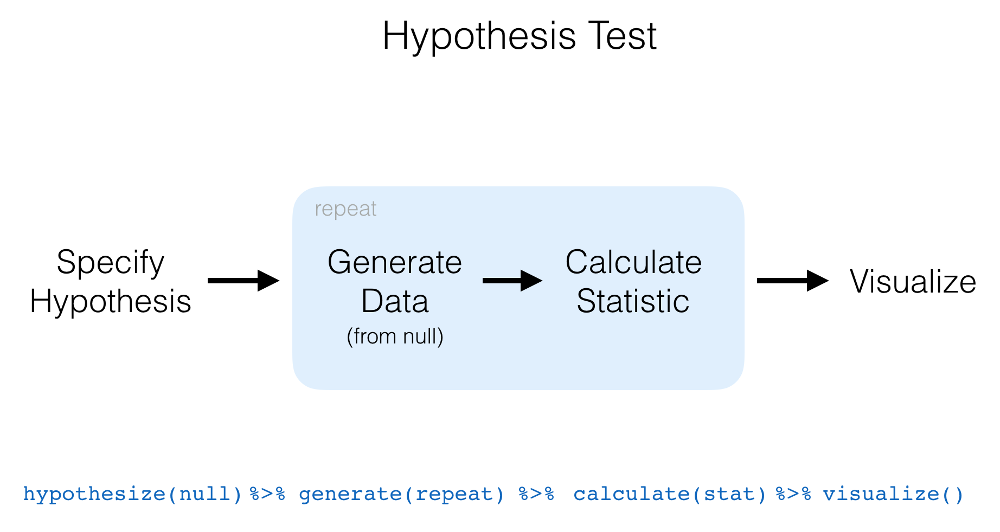

#### Examples

``` r
library(okcupiddata)
library(stringr)
library(infer)
set.seed(2017)
prof_small <- profiles %>% 
  dplyr::sample_n(size = 500) %>% 
  dplyr::mutate(frisco = dplyr::case_when(
    str_detect(location, "san fran") ~ "san fran",
    !str_detect(location, "san fran") ~ "not san fran"
  )) %>% 
  dplyr::select(age, sex, frisco, drugs, height, status)
```

-   `height` and `age` are numerical variables.
-   `sex` has two categories (`"m"`, `"f"`)
-   `frisco` has two categories (`"san fran"`, `"not san fran"`)
-   `drugs` has three categories (`"never"`, `"sometimes"`, `"often"`) - Also has missing values
-   `status` has three categories (`"single"`, `"available"`, `"seeing someone"`)

------------------------------------------------------------------------

One numerical variable (mean)

``` r
prof_small %>%
  specify(response = age) %>% # alt: age ~ NULL (or age ~ 1)
  hypothesize(null = "point", mu = 50) %>% 
  generate(reps = 1000, type = "bootstrap") %>% 
  calculate(stat = "mean") %>% 
  visualize()
```


One numerical variable (median)

``` r
prof_small %>%
  specify(response = age) %>% # alt: age ~ NULL (or age ~ 1)
  hypothesize(null = "point", Med = 55) %>% 
  generate(reps = 1000, type = "bootstrap") %>% 
  calculate(stat = "median") %>% 
  visualize()
```


One categorical (2 level) variable

``` r
prof_small %>%
  specify(response = sex) %>% # alt: sex ~ NULL (or sex ~ 1)
  hypothesize(null = "point", p = c("m" = .65)) %>% 
  generate(reps = 1000, type = "simulate") %>% 
  calculate(stat = "prop") %>% 
  visualize()
```

    ## Warning in parse_params(dots, x): Missing level, assuming proportion is 1 -
    ## 0.65.

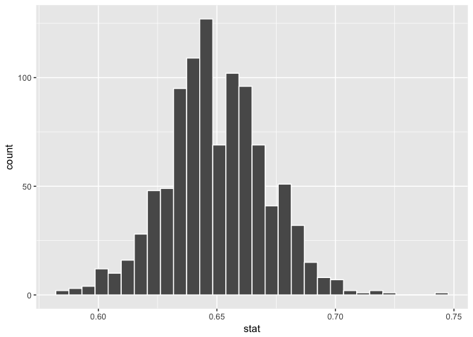

Two categorical (2 level) variables

``` r
prof_small %>%
  specify(sex ~ frisco) %>% # alt: response = sex, explanatory = vs
  hypothesize(null = "independence") %>%
  generate(reps = 1000, type = "permute") %>%
  calculate(stat = "diff in props") %>% 
  visualize()
```


One categorical (&gt;2 level) - GoF

``` r
prof_small %>%
  specify(drugs ~ NULL) %>% # alt: response = frisco
  hypothesize(null = "point", 
              p = c("never" = .7, "sometimes" = .25, "often" = .05)) %>%
  generate(reps = 1000, type = "simulate") %>%
  calculate(stat = "Chisq") %>% 
  visualize()
```

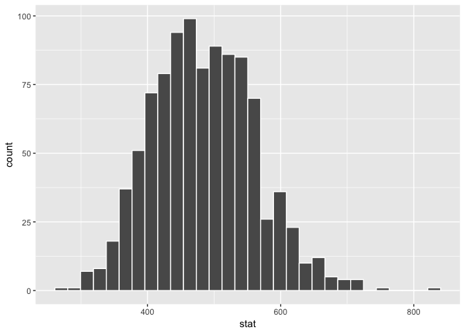

Two categorical (&gt;2 level) variables

``` r
prof_small %>%
  specify(drugs ~ status) %>% # alt: response = drugs, explanatory = status
  hypothesize(null = "independence") %>%
  generate(reps = 1000, type = "permute") %>%
  calculate(stat = "Chisq") %>% 
  visualize()
```

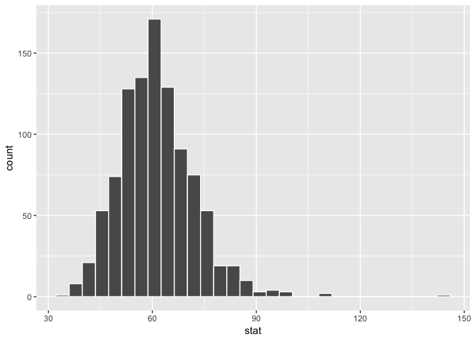

One numerical variable one categorical (2 levels) (diff in means)

``` r
prof_small %>%
  specify(age ~ sex) %>% # alt: response = age, explanatory = sex
  hypothesize(null = "independence") %>%
  generate(reps = 1000, type = "permute") %>%
  calculate(stat = "diff in means") %>% 
  visualize()
```

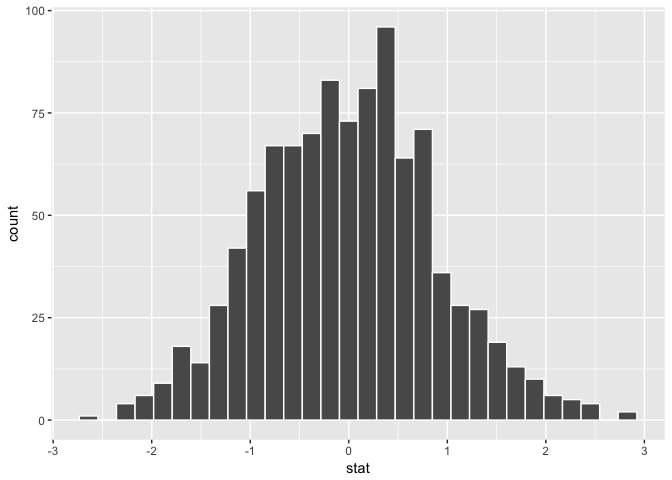

One numerical variable one categorical (2 levels) (diff in medians)

``` r
prof_small %>%
  specify(age ~ sex) %>% # alt: response = age, explanatory = sex
  hypothesize(null = "independence") %>%
  generate(reps = 1000, type = "permute") %>%
  calculate(stat = "diff in medians") %>% 
  visualize()
```

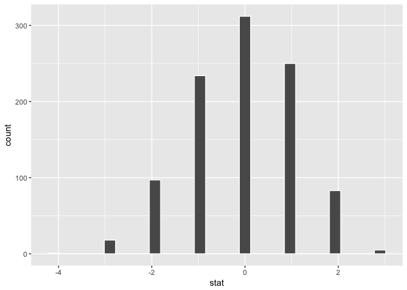

One numerical one categorical (&gt;2 levels) - ANOVA

``` r
prof_small %>%
  specify(age ~ status) %>% # alt: response = age, explanatory = frisco
  hypothesize(null = "independence") %>%
  generate(reps = 1000, type = "permute") %>%
  calculate(stat = "F") %>% 
  visualize()
```

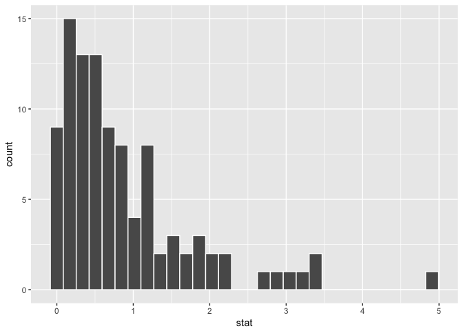

Two numerical vars - SLR

``` r
prof_small %>%
  specify(age ~ height) %>% # alt: response = age, explanatory = height
  hypothesize(null = "independence") %>% # or "slope = 0"
  generate(reps = 1000, type = "permute") %>%
  calculate(stat = "slope") %>% 
  visualize()
```

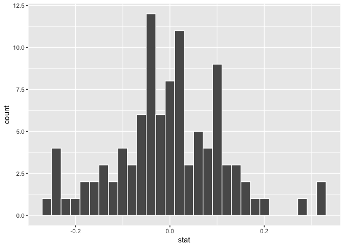

### Confidence intervals

One numerical (one mean)

``` r
prof_small %>%
  specify(response = age) %>%
  generate(reps = 1000, type = "bootstrap") %>%
  calculate(stat = "mean") %>% 
  visualize()
```

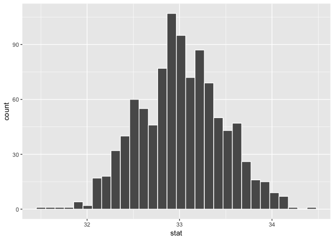

One numerical (one median)

``` r
prof_small %>%
  specify(response = age) %>%
  generate(reps = 1000, type = "bootstrap") %>%
  calculate(stat = "median") %>% 
  visualize()
```

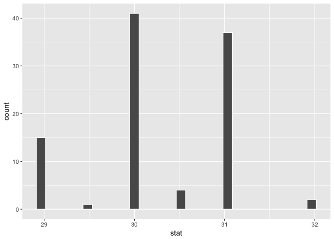

One categorical (one proportion) (not yet implemented)

    prof_small %>%
      specify(response = sex) %>%
      generate(reps = 1000, type = "bootstrap") %>%
      calculate(stat = "prop")

One numerical variable one categorical (2 levels) (diff in means)

``` r
prof_small %>%
  specify(age ~ sex) %>%
  generate(reps = 1000, type = "bootstrap") %>%
  calculate(stat = "diff in means") %>% 
  visualize()
```

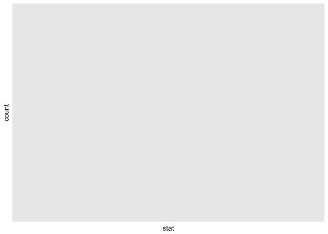

Two categorical variables (diff in proportions) (not yet implemented)

    prof_small %>%
      specify(sex ~ frisco) %>%
      generate(reps = 1000, type = "bootstrap") %>%
      calculate(stat = "diff in prop")

Two numerical vars - SLR

``` r
prof_small %>%
  specify(age ~ height) %>% 
  generate(reps = 1000, type = "bootstrap") %>%
  calculate(stat = "slope") %>% 
  visualize()
```

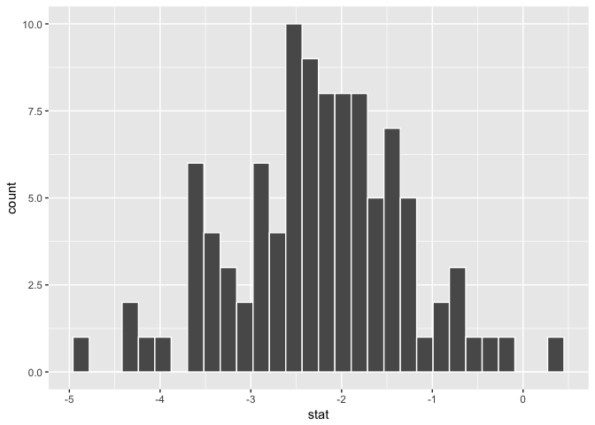
